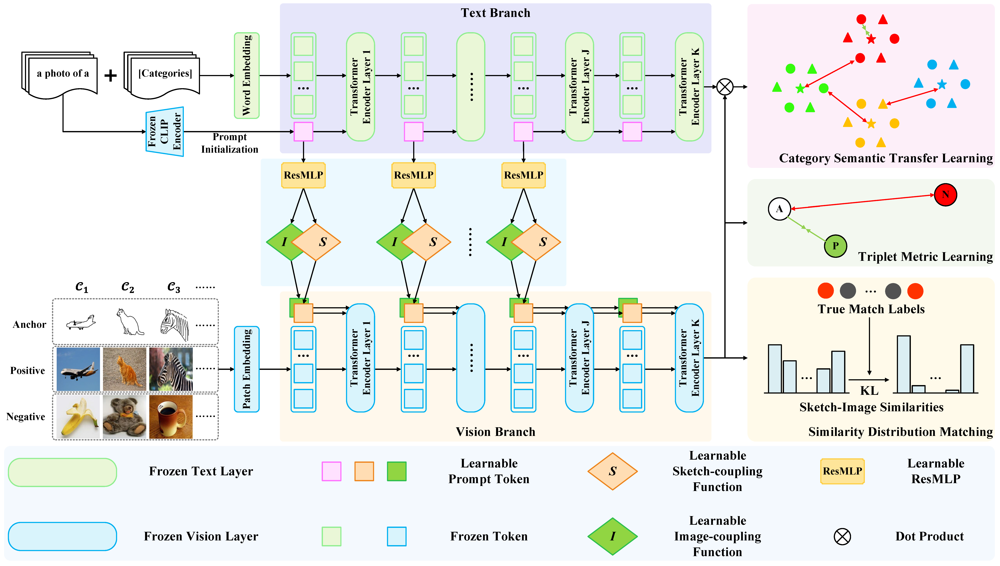

# Deep Residual Coupled Prompt Learning for Zero-Shot Sketch-Based Image Retrieval



## ========= Installation and Requirements =========

- ``` cudatoolkit=11.3.1  ```

- ``` numpy=1.19.3  ```

- ``` python=3.7.16  ```

- ``` pytorch=1.10.0  ```

- ``` torchvision=0.11.0  ```

## ============== Datasets ==============

### Sketchy, TU-Berlin and QuickDraw
Please go to the [ZSE-SBIR](https://github.com/buptLinfy/ZSE-SBIR)

## ============== Training ==============

- ``` CUDA_VISIBLE_DEVICES=1 python train.py  ```

## ============== Testing ==============

- ``` CUDA_VISIBLE_DEVICES=1 python test.py  ```
